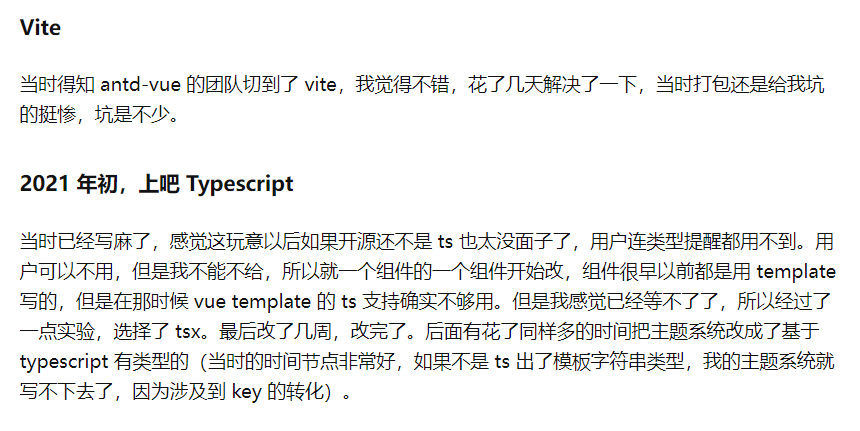

:::tip
从事实上来说。TypeScript 是选修的，并不影响学习框架，但 ES6 不是，这就是 JS 本身的内容。

```ts
// 一段简单的 TS 代码
function ToString<T>(a: T, b: T): string {
  return `${a}_${b}`;
}
```

:::

对于 TS 不知道怎么说，对于自由派来说是一种打压，其要求束缚太多，若是一个后端开发者介入，学习体验会好不少。

当前可以说，开源社区已经全面进入了 TS 时代，不支持 TS 的插件是很难使用的，因为使用 TS 开发的项目就不能使用你这一套，而 TS 可向下兼容（因为最后都是 JS 代码）。



## 益处是什么

TypeScript 最主要的便是前面的单词：**type（类型）**。

可为什么要接入强类型，在 TS 之前，不还是正常开发嘛，加上这一套反而增加了开发难度与成本。

> 瞎掰几点

这一点得认，但一个程序是存在更新迭代的，若是存在强类型在旁辅助，可以减少开发阶段出错的概率，且后续接手，也能更容易了解项目的架构。

## 学习

首先是说，会使用基础的 JS，那么就能快速上手 TS。一点都不懂的 JS 开发者那就相当于在学习一门新语言。

学习的成本不高，若是有强类型语言开发经验，学习起来会更快的。

- [TypeScript](https://www.typescriptlang.org/zh/)（语言官网）
- [TypeScript 入门教程](https://ts.xcatliu.com/)
- [TypeScript 中文手册](https://typescript.bootcss.com/)
- [深入理解 TypeScript](https://jkchao.github.io/typescript-book-chinese/)
