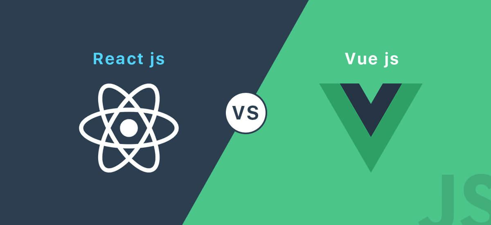

:::danger
该文章正在完善
:::

暂时来说，学院不会继续讲进阶的前端知识，这都需要自行去学习，

我将起步线定在，会写简单的 JS 代码 + 能使用 JQuery。

## ES6 & TypeScript

往下，有 [ES6](https://es6.ruanyifeng.com/) 版本存在（JS 新版本），提供了许多实用的新语法与函数。同时，还有一门扩展语言（JS 基础上扩展），叫做 [TypeScript](https://www.typescriptlang.org/zh/) （简称 TS）。这里我会直接建议学习 TypeScript，可以同时了解到 npm、Webpack。

:::tip
从事实上来说。TypeScript 是选修的，并不影响学习框架，但 ES6 不是，这就是 JS 本身的内容。

```ts
// 一段简单的 TS 代码
function ToString<T>(a: T, b: T): string {
    return `${a}_${b}`;
}
```

:::

## 前端框架

其次，学习框架 [Vue](https://cn.vuejs.org/)，这是一门**简单易上手**的框架，由它开始了解前端工具链、脚手架。

而 [React](https://zh-hans.reactjs.org/) 有一定难度（相比较 Vue），这是可选的学习，也许当你上手之后，会更喜欢它也说不定。

:::tip
因为 Vue 低廉的学习成本，当前已成为前端基本技能之一。
:::



### 源源不断的框架

并不是只存在这两个框架，只是它们使用最为广泛与经典，先学习最常用的，再谈其他新奇事物。

### 为什么要学习框架

因为当前插件、UI 组件都在围绕前端框架定制开发。只有懂得框架的基础使用，才能使用它们。

> 如 [Naive UI](https://www.naiveui.com/zh-CN/light)、[AntD](https://ant.design/index-cn)、[Nuxt](https://v3.nuxtjs.org/)
